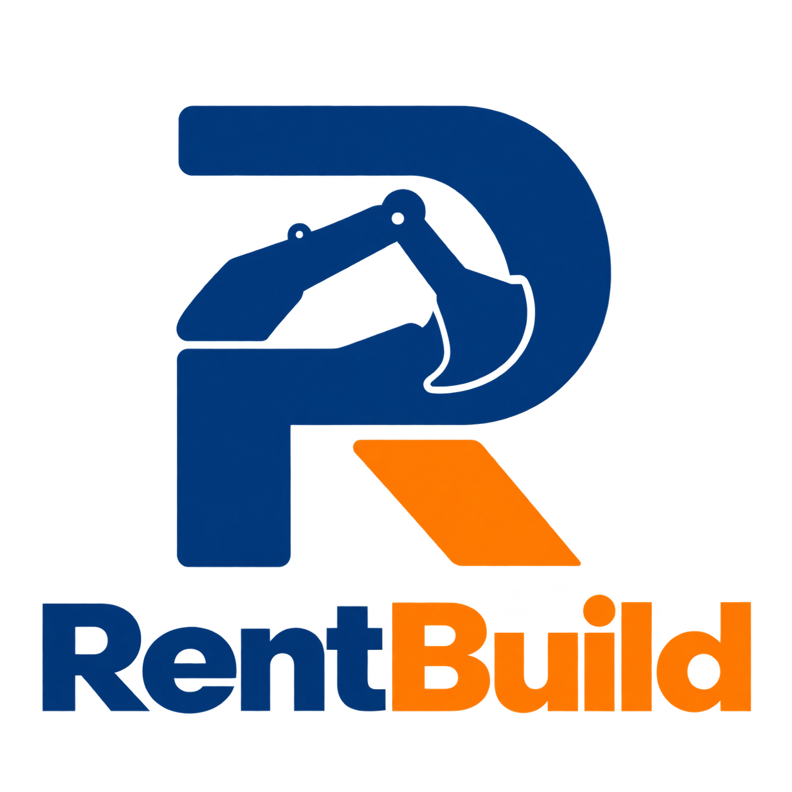

<div align="center">
  

# RentBuild — Vue Web Application

Plataforma web para la gestión del alquiler de maquinaria de construcción.

**CleanCode · Universidad Peruana de Ciencias Aplicadas**
</div>

Aplicación web desarrollada con **Vue 3 y JavaScript**, manteniendo los bounded contexts, entidades, políticas de negocio, adaptadores ACL, rutas y Fake API del proyecto original. La interfaz está implementada con componentes `.vue`, Composition API y formularios con `v-model` y validación HTML.

## Ejecutar

Requisitos: Node.js **22.18+** o **24.12+** y npm.

```powershell
npm ci
```

Puedes iniciar la API y Vue juntos en una sola terminal:

```powershell
npm run dev:mock
```

Al detener el comando se detienen ambos procesos. Para ejecutarlos por separado, inicia la API en una primera terminal:

```powershell
npm run api
```

Segunda terminal, frontend:

```powershell
npm run dev
```

Abrir **http://localhost:5173**. La API está en **http://localhost:3000/api/v1**. `npm start` también inicia Vite.

## Cuentas y datos locales

La Fake API publicada inicia sin usuarios ni operaciones. Registra cuentas ficticias desde Crear una cuenta, seleccionando empresa de alquiler o empresa constructora. El registro crea su perfil automáticamente. Los catálogos de categorías y planes sí están incluidos.

Para probar el recorrido, crea ambas cuentas. En la empresa de alquiler selecciona el plan Crecimiento, registra maquinaria y gestiona las solicitudes de la constructora. Prueba entrega, devolución y mantenimiento. Los datos locales de prueba no deben formar parte de los commits.

## Contextos y arquitectura

| Contexto      | Funcionalidad                                                                             |
| ------------- | ----------------------------------------------------------------------------------------- |
| IAM           | Registro, inicio/cierre de sesión, sesión persistente y control de acceso por rol.        |
| Profiles      | Consulta y edición de perfiles de empresa.                                                |
| Inventory     | Registro, edición, búsqueda, categorías, tarifas y disponibilidad.                        |
| Rentals       | Solicitudes recibidas y propias, aprobación/rechazo, alquileres, entregas y devoluciones. |
| Subscriptions | Comparación, contratación y cambio de planes, restricciones por suscripción.              |
| Maintenance   | Historial, programación, incidencias, bloqueo de alquiler y reactivación validada.        |
| Shared        | Navegación, internacionalización, transporte HTTP, errores y utilidades.                  |

```text
src/
├── main.js                   # Inicio de Vue
├── i18n.js                   # Vue I18n
├── locales/                  # Traducciones es/en
├── environments/
│   └── environment.js         # Configuración mediante VITE_*
└── app/
    ├── App.vue
    ├── app.routes.js         # Vue Router y controles de acceso
    ├── app.services.js       # Composición de servicios y puertos ACL
    ├── iam/
    ├── profiles/
    ├── inventory/
    ├── rentals/
    ├── subscriptions/
    ├── maintenance/
    └── shared/
server/
├── index.cjs                 # JSON Server y registro de usuarios/perfiles
├── db.json                   # Datos locales de demostración
└── routes.json
```

Cada contexto conserva `domain`, `infrastructure`, `application` y `presentation`. El dominio usa clases y objetos de valor en JavaScript. Los puertos están documentados con JSDoc, usan `Symbol` y se registran en la raíz de composición. Los ensambladores convierten los recursos de la API a entidades de dominio.

Los stores usan `shallowRef`, `shallowReadonly` y `computed` de Vue. Las referencias superficiales conservan las instancias de dominio con campos privados sin envolverlas en proxies. RxJS coordina los flujos HTTP existentes; `FetchClient` usa `fetch`, añade el token y cancela peticiones con `AbortController`. Al cambiar de usuario se cancelan operaciones pendientes y se limpian los datos de la sesión anterior. Un `401` en un recurso protegido cierra la sesión y vuelve al inicio de sesión; los errores de credenciales se muestran en el formulario.

`jsconfig.json` configura el editor para JavaScript y Vue. El alias `@/` apunta a `src/` tanto en el editor como en Vite.

Los componentes usan `<script setup>` en JavaScript. Vue Router gestiona la navegación y verifica sesión, rol y suscripción. Vue I18n ofrece español e inglés, con español inicial e idioma persistente. Los formularios, tablas y componentes Vue usan CSS adaptable a móvil.

## Rutas

| Ruta                                               | Vista                                                    |
| -------------------------------------------------- | -------------------------------------------------------- |
| `/iam/sign-in`, `/iam/sign-up`                     | Acceso y registro.                                       |
| `/dashboard`                                       | Panel principal según rol.                               |
| `/profiles/profile`                                | Perfil de empresa.                                       |
| `/inventory/equipment`                             | Inventario propio.                                       |
| `/inventory/equipment/new`                         | Registro de maquinaria.                                  |
| `/inventory/equipment/:id/edit`                    | Edición con verificación de propietario.                 |
| `/inventory/equipment/:id`                         | Detalle, disponibilidad y solicitud.                     |
| `/inventory/search`                                | Catálogo de proveedores con suscripción vigente.         |
| `/rentals/requests`                                | Solicitudes recibidas.                                   |
| `/rentals/active`                                  | Alquileres confirmados/activos, entregas y devoluciones. |
| `/rentals/my-requests`, `/rentals/my-requests/:id` | Solicitudes propias y detalle.                           |
| `/maintenance`, `/maintenance/incidents`           | Mantenimientos e incidencias.                            |
| `/subscriptions/plans`                             | Planes, suscripción y cambio de plan.                    |

Las reglas conservan la validación de reservas y alquileres superpuestos, la comprobación actualizada de disponibilidad y las restricciones por incidencias. Resolver una incidencia no reactiva automáticamente la maquinaria: se exige inspección confirmada, resolución de todos los bloqueos y ausencia de alquileres activos.

## Compilación y pruebas

```powershell
npm run build
npm run preview
```

`build` genera `dist/`. `npm test` ejecuta las pruebas Vitest que incorpore el equipo a sus ramas. Esta carga inicial aún no incluye pruebas automatizadas. La configuración Playwright y `scripts/test-api.cjs` quedan disponibles para añadir pruebas de navegador; no existen todavía casos E2E.

Los cambios manuales de la Fake API persisten en `server/db.json`; utiliza cuentas ficticias y conserva los datos locales fuera de los commits.

## Configuración y publicación

Crear `.env.local` para cambiar la API:

```dotenv
VITE_API_BASE_URL=http://localhost:3000/api/v1
VITE_USE_FAKE_API=true
```

Para un backend real, configurar su URL HTTPS y `VITE_USE_FAKE_API=false`. Esto cambia el inicio de sesión a `/authentication/sign-in`; el backend debe implementar los endpoints y contratos de recursos existentes. Reiniciar Vite o recompilar después de cambiar las variables.

El build sigue usando la API simulada por defecto para permitir la demostración local. Para publicar, servir `dist/`, configurar la API accesible y redirigir las rutas de la SPA a `index.html`. El hosting estático no inicia JSON Server automáticamente. La autenticación y autorización de la Fake API son únicamente para desarrollo; el backend real debe implementar los controles correspondientes.

## Respaldo de la migración

La copia local `.migration/original-source.zip` conserva el código anterior. Está excluida del control de versiones y no forma parte de la aplicación Vue.

## Créditos y repositorios originales

Migración basada en el proyecto MaquiGest de **CleanCode**. RentBuild utiliza su propia identidad visual y conserva las reglas de negocio del proyecto original. La base publicada contiene únicamente los catálogos iniciales.

- [Web app original](https://github.com/upc-pre-202620-1asi0729-7750-cleancode/maquigest-webapp)
- [Landing page original](https://github.com/upc-pre-202620-1asi0729-7750-cleancode/maquigest-website)
- [Informe original](https://github.com/upc-pre-202620-1asi0729-7750-cleancode/maquigest-report)

